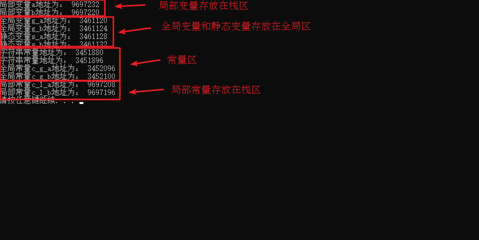

# C++入门

> 开发环境：Clion IDE gcc编译器

## 搭建开发环境

### CLion配置C++环境

为了能在控制台正确显示中文，需要在main函数中加入以下代码：

```cpp
system("chcp 65001");
```


### vscode配置C++环境

#### 编译器下载

采用gcc编译器,mingw里面包含gcc。

##### 下载MinGW-w64

下载地址：https://link.zhihu.com/?target=https%3A//github.com/niXman/mingw-builds-binaries/releases


解压到D盘mingw64文件夹中。

配置环境变量：

win+i 打开设置，点击系统，下滑找到系统信息，点击高级系统设置-环境变量。将路径添加到系统变量Path中。


win+r 输入cmd，打开终端。输入gcc -v，查看是否配置成功。


### 安装插件

code runner

C/C++

C/C++ Extension Pack

### 配置编译环境


`c_cpp_properties.json`

利用插件自动生成代码。


更改配置：


`launch.json`：调试代码用的。


```json
{
    "version": "0.2.0",
    "configurations": [
        {
            "name": "g++.exe - Build and debug active file",
            "type": "cppdbg",
            "request": "launch",
            "program": "${fileDirname}\\${fileBasenameNoExtension}.exe",
            "args": [],
            "stopAtEntry": false,
            "cwd": "${fileDirname}",
            "environment": [],
            "externalConsole": false,
            "MIMode": "gdb",
            "miDebuggerPath": "D:\\mingw64\\bin\\gdb.exe",
            "setupCommands": [
                {
                    "description": "Enable pretty-printing for gdb",
                    "text": "-enable-pretty-printing",
                    "ignoreFailures": true
                }
            ],
            "preLaunchTask": "C/C++: g++.exe 生成活动文件"
        }

    ]
}
```

`tasks.json`：用来将代码编译成可执行文件

终端-配置任务


点击运行代码，若出现乱码，重启即可。


运行完之后会自动生成一个settings.json。

文件结构:


C++常用的编译器：Clang  GCC（Linux） MSVC（微软的 比如VS就自带MSVC）

编译有四个过程（Toolchain）：预处理 编译 汇编 链接

CMake是构建项目的工具，可以自动生成Makefile文件，将源代码变成可执行程序。


## 基础语法

### 变量

### 数据类型

### 运算符

### 选择结构

### 循环结构

### 函数

### 指针

### 数组

### 引用

### 命名空间

## 1 内存分区模型

C++程序在执行时，将内存大方向划分为**4个区域**

- 代码区：存放函数体的二进制代码，由操作系统进行管理的
- 全局区：存放全局变量和静态变量以及常量
- 栈区：由编译器自动分配释放, 存放函数的参数值,局部变量等
- 堆区：由程序员分配和释放,若程序员不释放,程序结束时由操作系统回收


**内存四区意义：**

不同区域存放的数据，赋予不同的生命周期, 给我们更大的灵活编程


### 1.1 程序运行前

​	在程序编译后，生成了exe可执行程序，**未执行该程序前**分为两个区域

​	**代码区：**

​		存放 CPU 执行的机器指令

​		代码区是**共享**的，共享的目的是对于频繁被执行的程序，只需要在内存中有一份代码即可

​		代码区是**只读**的，使其只读的原因是防止程序意外地修改了它的指令

​	**全局区：**

​		全局变量和静态变量存放在此.

​		全局区还包含了常量区, 字符串常量和其他常量也存放在此.

​		==该区域的数据在程序结束后由操作系统释放==.


**示例：**

```c++
//全局变量
int g_a = 10;
int g_b = 10;

//全局常量
const int c_g_a = 10;
const int c_g_b = 10;

int main() {

	//局部变量
	int a = 10;
	int b = 10;

	//打印地址
	cout << "局部变量a地址为： " << (int)&a << endl;
	cout << "局部变量b地址为： " << (int)&b << endl;

	cout << "全局变量g_a地址为： " <<  (int)&g_a << endl;
	cout << "全局变量g_b地址为： " <<  (int)&g_b << endl;

	//静态变量
	static int s_a = 10;
	static int s_b = 10;

	cout << "静态变量s_a地址为： " << (int)&s_a << endl;
	cout << "静态变量s_b地址为： " << (int)&s_b << endl;

	cout << "字符串常量地址为： " << (int)&"hello world" << endl;
	cout << "字符串常量地址为： " << (int)&"hello world1" << endl;

	cout << "全局常量c_g_a地址为： " << (int)&c_g_a << endl;
	cout << "全局常量c_g_b地址为： " << (int)&c_g_b << endl;

	const int c_l_a = 10;
	const int c_l_b = 10;
	cout << "局部常量c_l_a地址为： " << (int)&c_l_a << endl;
	cout << "局部常量c_l_b地址为： " << (int)&c_l_b << endl;

	system("pause");

	return 0;
}
```

打印结果：




总结：

* C++中在程序运行前分为全局区和代码区
* 代码区特点是共享和只读
* 全局区中存放全局变量、静态变量、常量
* 常量区中存放 const修饰的全局常量  和 字符串常量


### 1.2 程序运行后


​	**栈区：**

​		由编译器自动分配释放, 存放函数的参数值,局部变量等

​		注意事项：不要返回局部变量的地址，栈区开辟的数据由编译器自动释放


**示例：**

```c++
int * func()
{
	int a = 10;
	return &a;
}

int main() {

	int *p = func();

	cout << *p << endl;
	cout << *p << endl;

	system("pause");

	return 0;
}
```


​	**堆区：**

​		由程序员分配释放,若程序员不释放,程序结束时由操作系统回收

​		在C++中主要利用new在堆区开辟内存

**示例：**

```c++
int* func()
{
	int* a = new int(10);
	return a;
}

int main() {

	int *p = func();

	cout << *p << endl;
	cout << *p << endl;
    
	system("pause");

	return 0;
}
```


**总结：**

堆区数据由程序员管理开辟和释放

堆区数据利用new关键字进行开辟内存


### 1.3 new操作符


​	C++中利用==new==操作符在堆区开辟数据

​	堆区开辟的数据，由程序员手动开辟，手动释放，释放利用操作符 ==delete==

​	语法：` new 数据类型`

​	利用new创建的数据，会返回该数据对应的类型的指针


**示例1： 基本语法**

```c++
int* func()
{
	int* a = new int(10);
	return a;
}

int main() {

	int *p = func();

	cout << *p << endl;
	cout << *p << endl;

	//利用delete释放堆区数据
	delete p;

	//cout << *p << endl; //报错，释放的空间不可访问

	system("pause");

	return 0;
}
```


**示例2：开辟数组**

```c++
//堆区开辟数组
int main() {

	int* arr = new int[10];

	for (int i = 0; i < 10; i++)
	{
		arr[i] = i + 100;
	}

	for (int i = 0; i < 10; i++)
	{
		cout << arr[i] << endl;
	}
	//释放数组 delete 后加 []
	delete[] arr;

	system("pause");

	return 0;
}

```


## 2 引用

### 2.1 引用的基本使用

**作用： **给变量起别名

**语法：** `数据类型 &别名 = 原名`


**示例：**

```C++
int main() {

	int a = 10;
	int &b = a;

	cout << "a = " << a << endl;
	cout << "b = " << b << endl;

	b = 100;

	cout << "a = " << a << endl;
	cout << "b = " << b << endl;

	system("pause");

	return 0;
}
```


### 2.2 引用注意事项

* 引用必须初始化
* 引用在初始化后，不可以改变

示例：

```C++
int main() {

	int a = 10;
	int b = 20;
	//int &c; //错误，引用必须初始化
	int &c = a; //一旦初始化后，就不可以更改
	c = b; //这是赋值操作，不是更改引用

	cout << "a = " << a << endl;
	cout << "b = " << b << endl;
	cout << "c = " << c << endl;

	system("pause");

	return 0;
}
```


### 2.3 引用做函数参数

**作用：**函数传参时，可以利用引用的技术让形参修饰实参

**优点：**可以简化指针修改实参


**示例：**

```C++
//1. 值传递
void mySwap01(int a, int b) {
	int temp = a;
	a = b;
	b = temp;
}

//2. 地址传递
void mySwap02(int* a, int* b) {
	int temp = *a;
	*a = *b;
	*b = temp;
}

//3. 引用传递
void mySwap03(int& a, int& b) {
	int temp = a;
	a = b;
	b = temp;
}

int main() {

	int a = 10;
	int b = 20;

	mySwap01(a, b);
	cout << "a:" << a << " b:" << b << endl;

	mySwap02(&a, &b);
	cout << "a:" << a << " b:" << b << endl;

	mySwap03(a, b);
	cout << "a:" << a << " b:" << b << endl;

	system("pause");

	return 0;
}

```


> 总结：通过引用参数产生的效果同按地址传递是一样的。引用的语法更清楚简单


### 2.4 引用做函数返回值


作用：引用是可以作为函数的返回值存在的


注意：**不要返回局部变量引用**

用法：函数调用作为左值


**示例：**

```C++
//返回局部变量引用
int& test01() {
	int a = 10; //局部变量
	return a;
}

//返回静态变量引用
int& test02() {
	static int a = 20;
	return a;
}

int main() {

	//不能返回局部变量的引用
	int& ref = test01();
	cout << "ref = " << ref << endl;
	cout << "ref = " << ref << endl;

	//如果函数做左值，那么必须返回引用
	int& ref2 = test02();
	cout << "ref2 = " << ref2 << endl;
	cout << "ref2 = " << ref2 << endl;

	test02() = 1000;

	cout << "ref2 = " << ref2 << endl;
	cout << "ref2 = " << ref2 << endl;

	system("pause");

	return 0;
}
```


### 2.5 引用的本质

本质：**引用的本质在c++内部实现是一个指针常量.**

指针常量：这个指针指向的变量是固定的。

讲解示例：

```C++
//发现是引用，转换为 int* const ref = &a;
void func(int& ref){
	ref = 100; // ref是引用，转换为*ref = 100
}
int main(){
	int a = 10;
    
    //自动转换为 int* const ref = &a; 指针常量是指针指向不可改，也说明为什么引用不可更改
	int& ref = a; 
	ref = 20; //内部发现ref是引用，自动帮我们转换为: *ref = 20;
    
	cout << "a:" << a << endl;
	cout << "ref:" << ref << endl;
    
	func(a);
	return 0;
}
```

结论：C++推荐用引用技术，因为语法方便，引用本质是指针常量，但是所有的指针操作编译器都帮我们做了


### 2.6 常量引用


**作用：** 常量引用主要用来修饰形参，防止误操作


在函数形参列表中，可以加==const修饰形参==，防止形参改变实参


**示例：**


```C++
//引用使用的场景，通常用来修饰形参
void showValue(const int& v) {
	//v += 10;
	cout << v << endl;
}

int main() {

	//int& ref = 10;  引用本身需要一个合法的内存空间，因此这行错误
	//加入const就可以了，编译器优化代码，int temp = 10; const int& ref = temp;
	const int& ref = 10;

	//ref = 100;  //加入const后不可以修改变量
	cout << ref << endl;

	//函数中利用常量引用防止误操作修改实参
	int a = 10;
	showValue(a);

	system("pause");

	return 0;
}
```


## 3 函数提高

### 3.1 函数默认参数


在C++中，函数的形参列表中的形参是可以有默认值的。

语法：` 返回值类型  函数名 （参数= 默认值）{}`


**示例：**

```C++
int func(int a, int b = 10, int c = 10) {
	return a + b + c;
}

//1. 如果某个位置参数有默认值，那么从这个位置往后，从左向右，必须都要有默认值
//2. 如果函数声明有默认值，函数实现的时候就不能有默认参数
int func2(int a = 10, int b = 10);
int func2(int a, int b) {
	return a + b;
}

int main() {

	cout << "ret = " << func(20, 20) << endl;
	cout << "ret = " << func(100) << endl;

	system("pause");

	return 0;
}
```


### 3.2 函数占位参数


C++中函数的形参列表里可以有占位参数，用来做占位，调用函数时必须填补该位置


**语法：** `返回值类型 函数名 (数据类型){}`


在现阶段函数的占位参数存在意义不大，但是后面的课程中会用到该技术


**示例：**

```C++
//函数占位参数 ，占位参数也可以有默认参数
void func(int a, int) {
	cout << "this is func" << endl;
}

int main() {

	func(10,10); //占位参数必须填补

	system("pause");

	return 0;
}
```


### 3.3 函数重载

#### 3.3.1 函数重载概述


**作用：**函数名可以相同，提高复用性


**函数重载满足条件：**

* 同一个作用域下
* 函数名称相同
* 函数参数**类型不同**  或者 **个数不同** 或者 **顺序不同**


**注意:**  函数的返回值不可以作为函数重载的条件


**示例：**

```C++
//函数重载需要函数都在同一个作用域下
void func()
{
	cout << "func 的调用！" << endl;
}
void func(int a)
{
	cout << "func (int a) 的调用！" << endl;
}
void func(double a)
{
	cout << "func (double a)的调用！" << endl;
}
void func(int a ,double b)
{
	cout << "func (int a ,double b) 的调用！" << endl;
}
void func(double a ,int b)
{
	cout << "func (double a ,int b)的调用！" << endl;
}

//函数返回值不可以作为函数重载条件
//int func(double a, int b)
//{
//	cout << "func (double a ,int b)的调用！" << endl;
//}


int main() {

	func();
	func(10);
	func(3.14);
	func(10,3.14);
	func(3.14 , 10);
	
	system("pause");

	return 0;
}
```


#### 3.3.2 函数重载注意事项


* 引用作为重载条件
* 函数重载碰到函数默认参数


**示例：**

```C++
//函数重载注意事项
//1、引用作为重载条件

void func(int &a)
{
	cout << "func (int &a) 调用 " << endl;
}

void func(const int &a)
{
	cout << "func (const int &a) 调用 " << endl;
}


//2、函数重载碰到函数默认参数

void func2(int a, int b = 10)
{
	cout << "func2(int a, int b = 10) 调用" << endl;
}

void func2(int a)
{
	cout << "func2(int a) 调用" << endl;
}

int main() {
	
	int a = 10;
	func(a); //调用无const
	func(10);//调用有const


	//func2(10); //碰到默认参数产生歧义，需要避免

	system("pause");

	return 0;
}
```


