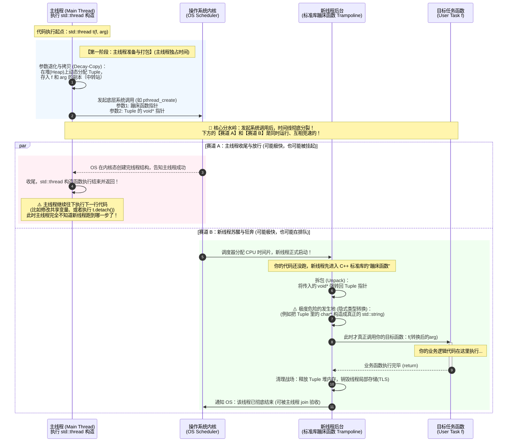

# C++11 并发编程

> 并发编程主要有多进程并发和多线程并发，C++标准并未对进程间通信提供任何原生支持，所以C++并发编程主要指的是多线程编程。我们会学习C++11标准提供的并发支持库（用来创建线程、管理线程生命周期、保护共享数据、线程间等待与通知、传递计算结果、原子操作的库），并发支持库许多实现都是对pthread的封装。在linux系统编程中我们学习了线程、线程同步、以及pthread线程库API等内容，这是学习C++并发支持库的基础。
>
> 所以学习并发编程前，需要掌握一定的操作系统、Linux系统编程的知识。
>
> 参考资料：B站码农论坛  [现代C++并发编程教程](https://mq-b.github.io/ModernCpp-ConcurrentProgramming-Tutorial/)

在C++11之前，C++没有对线程提供语言级别的支持，各种操作系统和编译器实现线程的方法不一样。C++11增加了线程以及线程相关的类，统一编程风格、简单易用、跨平台。

## 线程基础

> 在linux平台上，写一个多线程的C++程序，编译的时候一定要带上`-pthread`。


### 一、创建线程

头文件：`#include <thread>`
线程类：`std::thread`

#### 构造函数

1. `thread() noexcept;`
默认构造函数，构造一个线程对象，不执行任何任务（不会创建/启动子线程 也就是创建一个空线程对象）。
2. `template< class Function, class... Args >`
`explicit thread(Function&& fx, Args&&... args );`
创建线程对象，在线程中执行任务函数fx中的代码，args是要传递给任务函数fx的参数。
任务函数fx可以是普通函数、类的非静态成员函数、类的静态成员函数、lambda函数、仿函数（只要是可调用对象就可以）。
3. `thread(const thread& ) = delete;`
删除拷贝构造函数，不允许线程对象之间的拷贝。
4. `thread(thread&& other ) noexcept;`
移动构造函数，将线程other的资源所有权转移给新创建的线程对象。

#### 赋值函数 

`thread& operator= (thread&& other) noexcept;`
`thread& operator= (const other&) = delete;`
线程中的资源不能被复制，如果other是右值，会进行资源所有权的转移，如果other是左值，禁止拷贝。

>  线程对象不能拷贝、赋值。但可以移动语义、交换。

#### 注意

* std::thread是一个类，`std::thread t{ hello };`调用构造函数，创建一个线程对象t，用来管理线程，任务函数是hello。对象创建成功后，就自动在新线程执行hello任务函数。（线程对象关联了一个线程资源）。

  在 C++ 标准库中，没有直接管理线程的机制，只能通过对象关联线程后，通过该对象来管理线程。在C++中启动线程，就是构造thread对象。

- 先创建的子线程不一定跑得最快（程序运行的速度有很大的偶然性）。
- 线程的任务函数返回后，子线程将终止。
- 如果主程序（主线程）退出（不论是正常退出还是意外终止），全部的子线程将强行被终止。

```cpp
#include <iostream>
#include <thread>                // 线程类头文件。
#include <windows.h>         // Sleep()函数需要这个头文件。
using namespace std;

// 普通函数。
void func(int bh, const string& str) {
	for (int ii = 1; ii <= 10; ii++)
	{
		cout << "第" << ii << "次表白：亲爱的" << bh << "号，" << str << endl;
		Sleep(1000);   // 休眠1秒。
	}
}

// 仿函数。
class mythread1
{
public:
	void operator()(int bh, const string& str) {
		for (int ii = 1; ii <= 10; ii++)
		{
			cout << "第" << ii << "次表白：亲爱的" << bh << "号，" << str << endl;
			Sleep(1000);   // 休眠1秒。
		}
	}
};

// 类中有静态成员函数。
class mythread2
{
public:
	static void func(int bh, const string& str) {
		for (int ii = 1; ii <= 10; ii++)
		{
			cout << "第" << ii << "次表白：亲爱的" << bh << "号，" << str << endl;
			Sleep(1000);   // 休眠1秒。
		}
	}
};

// 类中有普通成员函数。
class mythread3
{
public:
	void func(int bh, const string& str) {
		for (int ii = 1; ii <= 10; ii++)
		{
			cout << "第" << ii << "次表白：亲爱的" << bh << "号，" << str << endl;
			Sleep(1000);   // 休眠1秒。
		}
	}
};

int main()
{
	// 用普通函数创建线程。
	//thread t1(func, 3, "我是一只傻傻鸟。");
	//thread t2(func, 8, "我有一只小小鸟。");

	// 用lambda函数创建线程。
	auto f = [](int bh, const string& str) {
		for (int ii = 1; ii <= 10; ii++)
		{
			cout << "第" << ii << "次表白：亲爱的" << bh << "号，" << str << endl;
			Sleep(1000);   // 休眠1秒。
		}
	};
	//thread t3(f, 3, "我是一只傻傻鸟。");

	// 用仿函数创建线程。
	//thread t4(mythread1(), 3, "我是一只傻傻鸟。");

	// 用类的静态成员函数创建线程。
	//thread t5(mythread2::func, 3, "我是一只傻傻鸟。");

	// 用类的普通成员函数创建线程。
	mythread3 myth;   // 必须先创建类的对象，必须保证对象的生命周期比子线程要长。（main函数结束 myth生命周期结束 因为有join main函数会阻塞等待t6结束，所以main函数的生命周期一定比t6长）
	thread t6(&mythread3::func, &myth, 3, "我是一只傻傻鸟。");  // 第二个参数必须填对象的this指针，否则会拷贝对象。
// &类名::非静态成员函数 这个形式叫做成员函数指针
	cout << "任务开始。\n";
	for (int ii = 0; ii < 10; ii++) {
		cout << "执行任务中......\n";
		Sleep(1000);   // 假设执行任务需要时间。
	}
	cout << "任务完成。\n";

	//t1.join();         // 回收线程t1的资源。
	//t2.join();         // 回收线程t2的资源。
	//t3.join();         // 回收线程t3的资源。
	//t4.join();         // 回收线程t4的资源。
	//t5.join();         // 回收线程t5的资源。
	t6.join();         // 回收线程t6的资源。
}
```

> 任务函数如果是仿函数，还有一些要说的东西：
>
> ```cpp
> //定义仿函数
> class Task{
> public:
>     void operator()()const {
>         std::cout << "operator()()const\n";
>     }
> };
> 
> int main()
> {
> 	std::thread t1(Task()); //本意thread类创建对象的写法，传进去Task临时对象。但是编译器会把这行代码解析成函数声明。函数参数是一个返回 Task 的空参的函数指针类型。所以最好用{}初始化。
>   std::thread t1(Task{}); //使用{}初始化。
> }
> ```

我们还需要通过几个例子深刻理解下thread构造函数。

我们知道向可调用对象（任务函数）传递参数，只需要把参数作为线程对象的构造参数即可。需要注意的是，这些参数会复制到新线程的内存空间中，即使任务函数中的参数是引用，**实际仍然是复制**。

> ```cpp
> void f(int, const int& a) //如果不是const引用，会编译错误。(这是因为 `std::thread` 内部会将保有的参数副本转换为**右值表达式进行传递**，这是为了那些**只支持移动的类型**，左值引用没办法引用右值表达式，所以产生编译错误。)
> {
>   ......
> }
> 
> int mian()
> {
>   int n = 1;
> 	std::thread t{ f, 3, n };
> }
> 
> ```
>
> 这显然不符合我们的设想，如果解决？我们可以使用标准库的设施 [`std::ref`](https://zh.cppreference.com/w/cpp/utility/functional/ref) 、 `std::cref` 函数模板。
>
> ```
> void f(int, int& a) {
>     std::cout << &a << '\n'; 
> }
> 
> int main() {
>     int n = 1;
>     std::cout << &n << '\n';
>     std::thread t { f, 3, std::ref(n) };
>     t.join();
> }
> ```
>
> > [运行代码](https://godbolt.org/z/zW6h1EK59)，打印地址完全相同。
>
> 我们来解释一下，“**ref**” 其实就是 “**reference**”（引用）的缩写，意思也很简单，返回“引用”，当然了，不是真的返回引用，它们返回一个包装类 [`std::reference_wrapper`](https://zh.cppreference.com/w/cpp/utility/functional/reference_wrapper)，顾名思义，这个类就是包装引用对象类模板，将对象包装，可以隐式转换为被包装对象的引用。
>
> “**cref**”呢？，这个“c”就是“**const**”，就是返回了 `std::reference_wrapper<const T>`。我们不详细介绍他们的实现，你简单认为`reference_wrapper`可以隐式转换为被包装对象的引用即可，
>
> ```cpp
> int n = 0;
> std::reference_wrapper<int> r = std::ref(n);
> int& p = r; // r 隐式转换为 n 的引用 此时 p 引用的就是 n
> ```
>
> ```
> int n = 0;
> std::reference_wrapper<const int> r = std::cref(n);
> const int& p = r; // r 隐式转换为 n 的 const 的引用 此时 p 引用的就是 n
> ```
>
> ```cpp
> struct move_only { //定义了一个类 禁用了拷贝构造函数
>     move_only() { std::puts("默认构造"); }
>     move_only(const move_only&) = delete;
>     move_only(move_only&&)noexcept {
>         std::puts("移动构造");
>     }
> };
> 
> void f(move_only){}
> 
> int main(){
>     move_only obj;
>     std::thread t{ f,std::move(obj) };
>     t.join();
> }
> ```
>
> > [运行](https://godbolt.org/z/b6fYWaf3Y)测试。
>
> 上述程序会有两次移动构造，一次是被 `std::thread` 构造函数中初始化副本，一次是调用函数 `f`。详细解释下：
>
> std::thread 规定：**必须把所有参数先“偷偷”备份一份，存在线程对象自己内部的存储空间里。** 你传入了一个std::move(obj)（一个右值），所以 std::thread 在创建内部备份时，调用了 move_only 的移动构造函数，把 obj 的内容移动到了内部存储空间中。这是第一次移动构造。
>
> 新线程启动后，会调用你指定的任务函数f，f需要的参数是move_only，新线程会拿着之前的备份对象，以右值的方式传给f的形参，导致形参在初始化的时候，又调用了移动构造函数。
>
> 如果还有不理解，不用担心，记住，这一切的问题都会在后面的 [`std::thread` 的构造-源码解析](https://mq-b.github.io/ModernCpp-ConcurrentProgramming-Tutorial/md/02使用线程.html#stdthread-的构造-源码解析) 解释清楚。

再来看一段代码：

```
void f(const std::string&);
std::thread t{ f,"hello" };
```

代码创建了一个调用 `f("hello")` 的线程。注意，函数 `f` 实际需要的是一个 `std::string` 类型的对象作为参数，但这里使用的是字符串字面量，字符串字面量的类型是 `const char[N]` ，它会退化成指向它的`const char*` 指针，被线程对象保存一个副本。新线程启动后，在调用 `f` 的时候，会把之前保存的副本传给f。系统隐式调用 `std::string` 的转换构造函数，把const char*变成一个临时的 `std::string` 对象，就能成功调用f，f接收的是这个临时对象的引用。

字符串字面量具有静态[*存储期*](https://zh.cppreference.com/w/cpp/language/storage_duration#.E5.AD.98.E5.82.A8.E6.9C.9F)，生命周期和程序一样长，指向它的指针不用担心生存期的问题，但是如果是指向“动态”对象的指针，就要特别注意了：

```cpp
void f(const std::string&);
void test(){
    char buffer[1024]{};
    //todo.. code
    std::thread t{ f,buffer };
    t.detach();
}
```

以上代码可能导致一些问题，buffer 是一个数组对象，作为 `std::thread` 构造参数的传递的时候会 **隐式转换为了指向这个数组的指针**。

我们要特别强调，`std::thread` 构造是代表“启动线程”，而不是调用我们传递的可调用对象。

`std::thread` 的构造函数中调用了创建线程的函数，新线程启动后，会拿着char*指针，调用函数 `f`。也就是说，调用和执行 `f(buffer)` 并不是说要在 `std::thread` 的构造函数中，而是在创建的新线程中，具体什么时候执行，取决于操作系统的调度，所以完全有可能函数 `test` 先执行完，而新线程此时还没有进行 `f(buffer)` 的调用，转换为`std::string`，那么 buffer 指针就**悬空**了，会导致问题。解决方案：

1. 将 `detach()` 替换为 `join()`。

   ```
   void f(const std::string&);
   void test(){
       char buffer[1024]{};
       //todo.. code
       std::thread t{ f,buffer };
       t.join();
   }
   ```

2. 显式将 `buffer` 转换为 `std::string`。

   ```cpp
   void f(const std::string&);
   void test(){
       char buffer[1024]{};
       //todo.. code
       std::thread t{ f,std::string(buffer) };
       t.detach();
   }
   ```

我们知道线程对象关联一个线程资源，两个线程对象不能同时拥有同一个线程。线程对象可以转移线程资源所有权。

通过移动构造函数：

```cpp
int main() {
    std::thread t{ [] {
        std::cout << std::this_thread::get_id() << '\n';
    } }; //
    std::cout << t.joinable() << '\n'; // 线程对象 t 当前关联了活跃线程 打印 1
    std::thread t2{ std::move(t) };    // 将 t 的线程资源的所有权移交给 t2
    std::cout << t.joinable() << '\n'; // 线程对象 t 当前没有关联活跃线程 打印 0
    //t.join(); // Error! t 没有线程资源
    t2.join();  // t2 当前持有线程资源
}
```

我们还可以使用移动赋值来转移线程资源的所有权：

```
int main() {
    std::thread t;      // 默认构造，没有关联活跃线程
    std::cout << t.joinable() << '\n'; // 0
    std::thread t2{ [] {} };
    t = std::move(t2); // 转移线程资源的所有权到 t
    std::cout << t.joinable() << '\n'; // 1
    t.join();
    
    t2 = std::thread([] {});
    t2.join();
}
```

我们只需要介绍 `t2 = std::thread([] {})` ，临时对象是右值表达式，不用调用 `std::move`，这里相当于是将临时的 `std::thread` 对象所持有的线程资源转移给 `t2`，`t2` 再调用 `join()` 正常析构。

函数返回 `std::thread` 对象：

```cpp
std::thread f(){
    std::thread t{ [] {} };
    return t;
}

int main(){
    std::thread rt = f();
    rt.join();
}
```

这段代码可以[通过编译](https://godbolt.org/z/14d7b9qn9)，你是否感到奇怪？我们在函数 f 中创建了一个局部的 `std::thread` 对象，启动线程，然后返回它。

这里的 `return t` *重载决议*[[1\]](https://mq-b.github.io/ModernCpp-ConcurrentProgramming-Tutorial/md/02使用线程.html#footnote1)选择到了**移动构造**，将 `t` 线程资源的所有权转移给函数调用 `f()` 返回的临时 `std::thread` 对象中，然后这个临时对象再用来初始化 `rt` ，临时对象是右值表达式，这里一样选择到**移动构造**，将临时对象的线程资源所有权移交给 `rt`。此时 `rt` 具有线程资源的所有权，由它调用 `join()` 正常析构。

**所有权也可以在函数内部传递**：

```
void f(std::thread t){
    t.join();
}

int main(){
    std::thread t{ [] {} };
    f(std::move(t));
    f(std::thread{ [] {} });
}
```

`std::move` 将 t 转换为了一个右值表达式，初始化函数`f` 形参 `t`，选择到了移动构造转移线程资源的所有权，在函数中调用 `t.join()` 后正常析构。`std::thread{ [] {} }` 构造了一个临时对象，本身就是右值表达式，初始化函数`f` 形参 `t`，移动构造转移线程资源的所有权到 `t`，`t.join()` 后正常析构。

### 二、线程资源的回收

虽然同一个进程的多个线程共享进程的栈空间，但是，每个子线程在这个栈中拥有自己私有的栈空间。所以，线程结束时需要回收资源。
回收子线程的资源有两种方法： 

1. 在主程序中，调用`join()`成员函数等待子线程退出，回收它的资源。如果子线程已退出，`join()`函数立即返回，否则会阻塞等待，直到子线程退出。还有个事情：一个线程对象只能调用join一次。

2. 在主程序中，调用`detach()`成员函数分离子线程（解除 `std::thread` 对象对线程的管理关系），子线程退出时，系统将自动回收资源。分离后的子线程不可`join()`。
用`joinable()`成员函数可以判断子线程的分离状态，函数返回布尔类型。返回 `false`，表示线程对象目前没有关联活跃线程。

2. `std::thread` 的析构函数，正是通过 `joinable()` 判断线程对象目前是否有关联活跃线程，如果为 `true`，那么就当做有关联活跃线程，会调用 `std::terminate()`，导致程序异常退出（**terminate通常会调用 `std::abort()`，直接结束进程。**）。

2. 在main函数中创建了一个线程对象，线程在main函数之前执行结束，如果main函数中没写join或detach，那么线程对象析构的时候状态仍然是joinable，这样析构对象的时候就会异常退出。也就说无论如何，都必须在thread对象析构之前写join或detach。

5. 调用 `join()` 就是确保线程对象关联的线程已经执行完毕，然后会修改对象的状态，解除对象和线程的关联。 `std::thread::joinable()`会 返回 `false`，这样析构对象的时候就能安全析构。

  > 不要对joinable有误解，joinable为true **并不表示“线程正在运行”**，而是表示**“这个 std::thread 对象仍持有一个底层线程的句柄（所有权），并且还没有进行过状态回收”。**

6. detach一个线程后，main函数（主线程）执行完，整个进程会被销毁，分离的线程自然会被销毁。但是销毁是有一段时间的，先销毁main中的局部变量，销毁过程中，如果线程持有main局部变量的指针或引用，正好执行相关的代码，就会发生未定义行为。

  比如：

  ```cpp
  #include <iostream>
  #include <thread>
  
  struct func {
      int& m_i;
      func(int& i) :m_i{ i } {}
      void operator()(int n)const {
          for (int i = 0; i <= n; ++i) {
              m_i += i;           // 可能悬空引用
          }
      }
  };
  
  int main(){
      int n = 0;
      std::thread my_thread{ func{n},100 };//子线程持有对局部变量n的引用
      my_thread.detach();        // 分离，不等待线程结束
  }                              // 分离的线程可能还在运行,main函数结束了，销毁局部变量n的时候，子线程还在访问，发生未定义行为。
  ```

  所以最好**非常不推荐使用 detach()。**

  **示例：**

```cpp
#include <iostream>
#include <thread>                // 线程类头文件。
#include <windows.h>         // Sleep()函数需要这个头文件。
using namespace std;

// 普通函数。
void func(int bh, const string& str) {
	for (int ii = 1; ii <= 10; ii++)
	{
		cout << "第" << ii << "次表白：亲爱的" << bh << "号，" << str << endl;
		Sleep(1000);   // 休眠1秒。
	}
}

int main()
{
	// 用普通函数创建线程。
	thread t1(func, 3, "我是一只傻傻鸟。");
	thread t2(func, 8, "我有一只小小鸟。");

	t1.detach(); t2.detach();  // 分离子线程。

	//cout << "任务开始。\n";
	//for (int ii = 0; ii < 12; ii++) {
	//	cout << "执行任务中......\n";
	//	Sleep(1000);   // 假设执行任务需要时间。
	//}
	//cout << "任务完成。\n";

	//t1.join();         // 回收线程t1的资源。
	//t2.join();         // 回收线程t2的资源。
	Sleep(12000);
}
```

再来看一下子线程运行后的异常问题。，举个例子：你在一个函数中构造了一个 std::thread 对象，线程开始执行，函数继续执行下面别的代码，但是如果抛出了异常呢？下面我的 **join() 就会被跳过**，在析构thread对象的时候发现joinable是true，程序就会崩溃。

```pp
std::thread my_thread{func{n},10};
//todo.. 抛出异常的代码
my_thread.join();
```

解决方法：在异常处理过程中调用 join()，从而避免线程对象析构产生问题。

```cpp
struct func; // 复用之前
void f(){
    int n = 0;
    std::thread t{ func{n},10 };
    try{
        // todo.. 一些当前线程可能抛出异常的代码
        f2();
    }
    catch (...){
        t.join(); // 1
        throw;
    }
    t.join();    // 2
}
```

为什么catch了异常还要重新throw。为什么要写两次join。

> - **如果不写 throw; 会怎样？**
>   如果 catch 块里只有 t.join();  而没有 throw;这意味着异常被**“吞掉（消化）”**了。
>   程序会认为错误已经处理完毕，然后继续往下执行。离开 catch 块后，代码会顺理成章地走到第 13 行，**再次执行 t.join(); // 2**！
>   **一个线程不能被 join 两次**。对同一个线程第二次调用 join() 会导致 std::system_error，引发新的崩溃。
> - **写了 throw; 的作用：**
>   throw; 的作用是**将捕获到的异常原封不动地重新抛出**给上一层函数。
>   一旦执行了 throw;，程序会再次强行跳出当前函数 f()，因此**绝对不会执行到第 13 行的 t.join(); // 2**。
>   这样既保证了异常能传递给上层处理，又完美避开了“被 join 两次”的逻辑错误。

我们还可以通过“[资源获取即初始化](https://zh.cppreference.com/w/cpp/language/raii)”(RAII，Resource Acquisition Is Initialization)。思想来解决异常问题。

简单的说是：***构造函数申请资源，析构函数释放资源，让对象的生命周期和资源绑定***。当异常抛出时，C++ 会自动调用对象的析构函数。

我们可以提供一个类，在析构函数中使用 join() 确保线程执行完成，线程对象正常析构。

```cpp
class thread_guard{
    std::thread& m_t;
public:
    explicit thread_guard(std::thread& t) :m_t{ t } {}
    ~thread_guard(){
        std::puts("析构");     // 打印日志 不用在乎
        if (m_t.joinable()) { // 线程对象当前关联了活跃线程
            m_t.join();
        }
    }
    thread_guard(const thread_guard&) = delete; //禁用拷贝构造函数
    thread_guard& operator=(const thread_guard&) = delete; //禁用复制赋值运算符
};
void f(){
    int n = 0;
    std::thread t{ func{n},10 };
    thread_guard g(t);
    f2(); // 可能抛出异常
}
```

函数 f 执行完毕，局部对象就要逆序销毁了。因此，thread_guard 对象 g 是第一个被销毁的，**调用析构函数**。**即使函数 f2() 抛出了一个异常，这个销毁依然会发生（前提是你捕获了这个异常）**。这确保了线程对象 t 所关联的线程正常的执行完毕以及线程对象的正常析构(当析构完g之后就会析构t，析构函数检查joinable发现是false，不会调用terminate)。[测试代码](https://godbolt.org/z/hn7Gced84)。

> 如果异常被抛出但未被捕获那么就会调用 [std::terminate](https://zh.cppreference.com/w/cpp/error/terminate)。是否对未捕获的异常进行任何栈回溯由**实现定义**。（简单的说就是不一定会调用析构）
>
> 我们的测试代码是捕获了异常的，为了观测，看到它一定打印“*析构*”。

在 thread_guard 的析构函数中，我们要判断 `std::thread` 线程对象现在是否有关联的活跃线程，如果有，我们才会执行 **`join()`**，阻塞当前线程直到线程对象关联的线程执行完毕。如果不想等待线程结束可以使用 `detach()` ，但是这让 `std::thread` 对象失去了线程资源的所有权，难以掌控，具体如何，看情况分析。

复制赋值和复制构造定义为 `=delete` 可以防止编译器隐式生成，同时会[**阻止**](https://zh.cppreference.com/w/cpp/language/rule_of_three#.E4.BA.94.E4.B9.8B.E6.B3.95.E5.88.99)移动构造函数和移动赋值运算符的隐式定义。这样的话，对 thread_guard 对象进行复制或赋值等操作会引发一个编译错误。

不允许这些操作主要在于：这是个管理类，而且顾名思义，它就应该只是单纯的管理线程对象仅此而已，只保有一个引用，**单纯的做好 RAII 的事情就行，允许其他操作没有价值。**

接下来我们仔细分析下thread构造函数内部到底做了哪些事情，线程对象创建成功后，才会运行子线程吗？线程和任务函数是什么关系，子线程运行代表执行任务函数吗？




### 三、this_thread的全局函数

C++11提供了命名空间`this_thread`来表示当前线程，该命名空间中有四个函数：`get_id()`、`sleep_for()`、`sleep_until()`、`yield()`。
1. `get_id()`
    `thread::id` `get_id()` noexcept;
    该函数用于获取线程ID，thread类也有同名的成员函数。

2. `sleep_for()`  VS  `Sleep(1000)`   Linux `sleep(1)` 单位是秒 vs平台下是ms。
    `template <class Rep, class Period>`
    `void sleep_for (const chrono::duration<Rep,Period>& rel_time);` //chrono是std下的名字空间
    该函数让线程休眠一段时间。

3. `sleep_until()`          2022-01-01 12:30:35
    `template <class Clock, class Duration>`
    `void sleep_until (const chrono::time_point<Clock,Duration>& abs_time);`
    该函数让线程休眠至指定时间点。（可实现定时任务）

4. `yield()`
    `void yield() noexcept;`
    该函数让线程主动让出自己已经抢到的CPU时间片。

5. thread类其它的成员函数
    `void swap(std::thread& other);    // 交换两个线程对象。`
    `static unsigned hardware_concurrency() noexcept;   // 返回硬件线程最大并行数量。` **在进行多线程编程时，我们可以参考此值来确定创建的线程数量，以更好地利用当前硬件，从而提升程序性能。**

  一款 4 核心 8 线程的 CPU，这里的 8 线程其实是指所谓的*逻辑处理器*，也意味着这颗 CPU 最多可并行执行 8 个任务。

  我们的 `hardware_concurrency()` 获取的值自然也会是 **8**。

  The interpretation of this value is system- andimplementation- specific, and may not be exact, but just an approximation.
  Note that this does not need to match the actualnumber of processors or cores available in the system: A system can supportmultiple threads per processing unit, or restrict the access to its resourcesto the program.
  If this value is not computable or well defined,the function returns 0.

6. **示例：**

```cpp
#include <iostream>
#include <thread>                // 线程类头文件。
using namespace std;

// 普通函数。
void func(int bh, const string& str) {
	cout << "子线程：" << this_thread::get_id() << endl;

	for (int ii = 1; ii <= 3; ii++)
	{
		cout << "第" << ii << "次表白：亲爱的" << bh << "号，" << str << endl;
		this_thread::sleep_for(chrono::seconds(1));    // 休眠1秒。
	}
}

int main()
{
	// 用普通函数创建线程。
	thread t1(func, 3, "我是一只傻傻鸟。");
	thread t2(func, 8, "我有一只小小鸟。");

	cout << "主线程：" << this_thread::get_id() << endl;
	cout << "线程t1：" << t1.get_id() << endl;
	cout << "线程t2：" << t2.get_id() << endl;

	t1.join();         // 回收线程t1的资源。
	t2.join();         // 回收线程t2的资源。
}
```


### 四、call_once函数

在多线程环境中，某些函数只能被调用一次，例如：初始化某个对象，而这个对象只能被初始化一次。
在线程的任务函数中，可以用`std::call_once()`来保证某个函数只被调用一次。
头文件：`#include <mutex>`
`template< class callable, class... Args >`
`void call_once( std::once_flag& flag, Function&& fx, Args&&... args );`
第一个参数是`std::once_flag`，用于标记函数fx是否已经被执行过。
第二个参数是需要执行的函数fx。
后面的可变参数是传递给函数fx的参数。
**示例：**

```cpp
#include <iostream>
#include <thread>        // 线程类头文件。
#include <mutex>        // std::once_flag和std::call_once()函数需要包含这个头文件。
using namespace std;

once_flag onceflag;       // once_flag全局变量。本质是取值为0和1的锁。
// 在线程中，打算只调用一次的函数。（不管启动多少线程 只调用一次）
void once_func(const int bh, const string& str)  {
	cout << "once_func() bh= " << bh << ", str=" << str << endl;
}

// 普通函数。
void func(int bh, const string& str) {
	call_once(onceflag,once_func,0, "各位观众，我要开始表白了。");

	for (int ii = 1; ii <= 3; ii++)
	{
		cout << "第" << ii << "次表白：亲爱的" << bh << "号，" << str << endl;
		this_thread::sleep_for(chrono::seconds(1));    // 休眠1秒。
	}
}

int main()
{
	// 用普通函数创建线程。
	thread t1(func, 3, "我是一只傻傻鸟。");
	thread t2(func, 8, "我有一只小小鸟。");

	t1.join();         // 回收线程t1的资源。
	t2.join();         // 回收线程t2的资源。
}
```


### 五、native_handle函数

C++11定义了线程标准，不同的平台和编译器在实现的时候，本质上都是对操作系统的线程库进行封装，会损失一部分功能。
为了弥补C++11线程库的不足，thread类提供了`native_handle()`成员函数，用于获得与操作系统相关的原生线程句柄，操作系统原生的线程库就可以用原生线程句柄（线程的标识 可以类比文件描述符）操作线程。
**示例：** 如果有这样一个需求：在子线程运行的过程中，中止它。C++线程库没有这个功能，所以可以用操作系统原生的线程库API pthread_cancel。

```cpp
#include <iostream>
#include <thread>
#include <pthread.h>        // Linux的pthread线程库头文件。
using namespace std;

void func()    // 线程任务函数。
{
  for (int ii=1;ii<=10;ii++)
  {
    cout << "ii=" << ii << endl;
    this_thread::sleep_for(chrono::seconds(1));    // 休眠1秒。
  }
}

int main()
{
  thread tt(func);          // 创建线程。

  this_thread::sleep_for(chrono::seconds(5));    // 休眠5秒。

  pthread_t thid= tt.native_handle();  // 获取Linux操作系统原生的线程句柄。

  pthread_cancel(thid);  // 取消线程。

  tt.join();   // 等待线程退出。
}
```

编译命令：`g++ ........ -lpthread` 也就是最后加一个-lpthread选项。

### 六、线程安全

同一进程中的多个线程共享该进程中的全部的系统资源，多个线程访问同一共享资源的时候会产生冲突。

和线程安全相关的几个概念：

* 顺序性：

程序按照代码的先后顺序执行。CPU 为了提高程序整体的执行效率，可能会对代码进行优化，按更高效的顺序执行。CPU 虽然不保证完全按照代码的顺序执行，但它会保证最终的结果和按代码顺序执行时的结果一致。

* 可见性：

线程操作共享变量时，会将该变量从内存加载到 CPU 缓存中，修改该变量后，CPU 会立即更新缓存，但不一定会立即将它写回内存。这时候，如果其它线程访问该变量，从内存中读到的是旧数据，而非第一个线程操作后的数据。

当多个线程并发访问共享变量时，一个线程对共享变量的修改，其它线程能够立即看到。

* 原子性：

 CPU 执行指令：读取指令、读取内存、执行指令、写回内存。

 `i++`
 1）从内存中读取 i 的值；
 2）把 i+1；
 3）把结果写回内存。

一个操作（有可能包含有多个步骤）要么全部执行（生效），要么全部都不执行（都不生效）这就是原子操作。i++不是原子操作。

从下面这个程序出发，研究多线程问题。

```cpp
#include <iostream>
#include <thread>        // 线程类头文件。
using namespace std;

int aa = 0;     // 定义全局变量。

// 普通函数，把全局变量aa加1000000次。
void func() {
	for (int ii = 1; ii <= 1000000; ii++)
		aa++;
}

int main()
{
	// 用普通函数创建线程。
	thread t1(func);     // 创建线程t1，把全局变量aa加1000000次。
	thread t2(func);     // 创建线程t2，把全局变量aa加1000000次。

	t1.join();         // 回收线程t1的资源。
	t2.join();         // 回收线程t2的资源。

	cout << "aa=" << aa << endl;   // 显示全局变量aa的值。
}

```

如果是多核CPU：可能会发生下面这种情况：两个线程同时读取了aa，一个线程将aa写回CPU之后，另一个线程也写回。最终aa只加了一次。所以最后aa的结果不是2000000。


> 两个线程可以在同一时刻读取aa，但是不可能同一时刻把aa写回内存。这是因为CPU 的**缓存一致性协议**(MESI)会把对同一个 cache line 的写**强制串行化**——同一时刻只允许一个核把这个 cache line 置于"已修改"(Modified)状态,别的核必须先让出。所以两个核物理上**不可能真的同时写同一个地址**,硬件会让它们排队,一个接一个。

但如果是单核CPU，aa的结果就是2000000。这是为什么呢？理论上来说单核CPU中两个线程会并发执行，由于aa++不是原子操作，当一个线程读取aa并+1后，假如此时时间片用完了，cpu切换到另一个线程，另一个线程读取到aa仍然是旧值。最后aa不应该是2000000。

看 `-O0` 下 `aa++` 编译成什么：

```asm
movl  aa(%rip), %eax    ; 读
addl  $1, %eax          ; 改
movl  %eax, aa(%rip)    ; 写
```

你担心的"危险窗口"就是读和写之间那一两条指令那么宽。要丢失更新,必须让一次上下文切换**恰好**落在这个极窄的窗口里。

而整个程序只跑几毫秒,Linux 的时间片是毫秒级,所以全程总共也就发生**寥寥几次**切换。一次切换刚好砸进那个两指令宽的缝里的概率极低,经常一次都碰不上——于是结果就是满满的 2000000。**不是不可能,是概率太小。**

多个线程同时进行cout 

**"两个线程不会同时往屏幕输出"** —— 只在**最小颗粒**上成立。真正不能同时发生的,是"把某一小段字节拷进缓冲区"这种原子级小动作(硬件/库会让它们排队,就像前面内存写一样)。但一条 `cout` 语句可能由好几个这种小动作组成,**语句整体不是原子的**。


如何保证线程安全：

* volatile关键字（不能保证线程安全） 作用：`volatile` 告诉编译器：这个变量可能被程序之外的因素修改，所以每次访问都要真的去内存读写，不要把它长期缓存到寄存器里，也不要随便把相关读写优化掉。
* 线程同步
* 原子操作

## 线程同步

同步的意思是步调一致，协同工作，按一定的次序进行。 

线程同步就是协商如何使用共享资源。多个线程在访问共享资源时，通过某种机制协调执行顺序，保证数据不会被读错、写乱。

### 互斥锁

加锁和解锁，确保同一时间只有一个线程访问共享资源。访问共享资源前先加锁，访问完成后释放锁。如果某个线程持有锁，其他的线程形成等待队列。

C++11提供了四种互斥锁：

- `mutex`：互斥锁。（一般就用这一种）
- `timed_mutex`：带超时机制的互斥锁。
- `recursive_mutex`：递归互斥锁。
- `recursive_timed_mutex`：带超时机制的递归互斥锁。
包含头文件：`#include <mutex>`

#### 一、mutex类

1. 加锁`lock()`
互斥锁有锁定和未锁定两种状态。如果互斥锁是未锁定状态，调用`lock()`成员函数的线程会得到互斥锁的所有权，并将其上锁。如果互斥锁是锁定状态，调用`lock()`成员函数的线程就会阻塞等待，直到互斥锁变成未锁定状态。
2. 解锁`unlock()`
只有持有锁的线程才能解锁。
3. 尝试加锁`try_lock()`
如果互斥锁是未锁定状态，则加锁成功，函数返回true。
如果互斥锁是锁定状态，则加锁失败，函数立即返回false。（线程不会阻塞等待）

```cpp
#include <iostream>
#include <thread>                // 线程类头文件。
#include <mutex>                // 互斥锁类的头文件。
using namespace std;

mutex mtx;        // 创建互斥锁，保护共享资源cout对象。

// 普通函数。
void func(int bh, const string& str) {
	for (int ii = 1; ii <= 10; ii++)
	{
		mtx.lock();      // 申请加锁。
		cout << "第" << ii << "次表白：亲爱的" << bh << "号，" << str << endl;
		mtx.unlock();  // 解锁。
		this_thread::sleep_for(chrono::seconds(1));     // 休眠1秒。
	}
}

int main()
{
	// 用普通函数创建线程。
	thread t1(func, 1, "我是一只傻傻鸟。");
	thread t2(func, 2, "我是一只傻傻鸟。");
	thread t3(func, 3, "我是一只傻傻鸟。");
	thread t4(func, 4, "我是一只傻傻鸟。");
	thread t5(func, 5, "我是一只傻傻鸟。");

	t1.join();         // 回收线程t1的资源。
	t2.join();         // 回收线程t2的资源。
	t3.join();         // 回收线程t3的资源。
	t4.join();         // 回收线程t4的资源。
	t5.join();         // 回收线程t5的资源。
}
```


#### 二、timed_mutex类

增加了两个成员函数：
`bool try_lock_for(时间长度);`
`bool try_lock_until(时间点);`

#### 三、recursive_mutex类

递归互斥锁允许同一线程多次获得互斥锁，可以解决同一线程多次加锁造成的死锁问题。

比如下面这段代码：

```cpp
#include <iostream>
#include <mutex>        // 互斥锁类的头文件。
using namespace std;

class AA
{
	mutex m_mutex;
public:
	void func1() {
		m_mutex.lock();
		cout << "调用了func1()\n";
		m_mutex.unlock();
	}

	void func2() {
		m_mutex.lock();
		cout << "调用了func2()\n";
		func1();//调用fuc1前，已经拿到了锁，调用func1，func1会执行lock，阻塞等待锁，但锁已经被func2拿到了，导致死锁。
		m_mutex.unlock();
	}
};

int main()
{
	AA aa;
	//aa.func1();
	aa.func2();
}
```

直接把mutex改成recursive_mutex。

```cpp
#include <iostream>
#include <mutex>        // 互斥锁类的头文件。
using namespace std;

class AA
{
	recursive_mutex m_mutex;
public:
	void func1() {
		m_mutex.lock();
		cout << "调用了func1()\n";
		m_mutex.unlock();
	}

	void func2() {
		m_mutex.lock();
		cout << "调用了func2()\n";
		func1();
		m_mutex.unlock();
	}
};

int main()
{
	AA aa;
	//aa.func1();
	aa.func2();
}
```


#### 四、lock_guard类

`lock_guard`是模板类，可以简化互斥锁的使用，也更安全。
`lock_guard`的定义如下：

```cpp
template<class Mutex>
class lock_guard
{
    explicit lock_guard(Mutex& mtx);
}
```

`lock_guard`在构造函数中加锁，在析构函数中解锁。
`lock_guard`采用了RAII思想（在类构造函数中分配资源，在析构函数中释放资源，保证资源在离开作用域时自动释放）。

```cpp
#include <iostream>
#include <thread>        // 线程类头文件。
using namespace std;

int aa = 0;     // 定义全局变量。
mutex mtx;
// 普通函数，把全局变量aa加1000000次。
void func() {
	for (int ii = 1; ii <= 1000000; ii++)
    lock_guard<mutex> mlock(mtx);
		aa++;
}

int main()
{
	// 用普通函数创建线程。
	thread t1(func);     // 创建线程t1，把全局变量aa加1000000次。
	thread t2(func);     // 创建线程t2，把全局变量aa加1000000次。

	t1.join();         // 回收线程t1的资源。
	t2.join();         // 回收线程t2的资源。

	cout << "aa=" << aa << endl;   // 显示全局变量aa的值。
}

```

### 条件变量

条件变量是一种线程同步机制。当条件不满足时，相关线程被一直阻塞，直到某种条件出现，这些线程才会被唤醒。

为了保护共享资源，条件变量需要和互斥锁结合一起使用。

C++11的条件变量提供了两个类：

- `condition_variable`：只支持与普通`mutex`搭配，效率更高。(一般就用这个)
- `condition_variable_any`：是一种通用的条件变量，可以与任意`mutex`搭配（包括用户自定义的锁类型）。
- 包含头文件：`#include <condition_variable>`

#### condition_variable类

主要成员函数

1. `condition_variable`() 默认构造函数。
2. `condition_variable(const condition_variable &)=delete 禁止拷贝。`
3. `condition_variable& condition_variable::operator=(const condition_variable &)=delete 禁止赋值。`
4. `notify_one()` 通知一个等待的线程。
5. `notify_all()` 通知全部等待的线程。
6. `wait(unique_lock<mutex> lock)` 阻塞当前线程，直到通知到达。
7. `wait(unique_lock<mutex> lock,Pred pred)` 循环的阻塞当前线程，直到通知到达且谓词满足。
8. `wait_for(unique_lock<mutex> lock,时间长度)`
9. `wait_for(unique_lock<mutex> lock,时间长度,Pred pred)`
10. `wait_until(unique_lock<mutex> lock,时间点)`
11. `wait_until(unique_lock<mutex> lock,时间点,Pred pred)`

条件变量中wait函数内部流程：把互斥锁解锁、阻塞等待被唤醒、给互斥锁加锁。

#### unique_lock类

`template <class Mutex> class unique_lock是模板类，模板参数为互斥锁类型。`
unique_lock和`lock_guard`都是管理锁的辅助类，都是RAII风格（在构造时获得锁，在析构时释放锁）。它们的区别在于：为了配合`condition_variable`，unique_lock还有`lock()`和`unlock()`成员函数。（unique_lock  lock_guard  两个都是自动加锁、解锁（构造时自动调用 `mtx.lock()`，离开作用域的时候自动调用 `mtx.unlock()`，就自动解锁了）。unique_lock更复杂，可以在中途手动解锁、加锁。）

条件变量最常用的场景就是生产消费者模型：

### 生产消费者模型

生产者-消费者模型是一种常见的多线程协作模型：生产者线程负责产生数据，并将数据放入共享的缓存队列；消费者线程负责从共享队列中取出数据并进行处理。由于多个生产者和多个消费者可能会同时访问同一个队列，因此需要使用 `mutex` 互斥锁保护共享队列，保证同一时刻只有一个线程能够执行 `push`、`front`、`pop` 等操作，避免数据竞争。当队列为空时，消费者不应该一直循环等待，而是通过 `condition_variable` 条件变量进入阻塞状态；当生产者放入新数据后，再通过 `notify_one()` 或 `notify_all()` 唤醒消费者。共享缓存队列的作用是解耦生产者和消费者的速度，使生产和消费可以异步进行，从而提高程序的并发处理能力。


**示例1：**

```cpp
#include <iostream>
#include <string>
#include <thread>                      // 线程类头文件。
#include <mutex>                      // 互斥锁类的头文件。
#include <deque>                      // deque容器的头文件。
#include <queue>                      // queue容器的头文件。
#include <condition_variable>  // 条件变量的头文件。
using namespace std;
class AA
{
    mutex m_mutex;                                    // 互斥锁。
    condition_variable m_cond;                  // 条件变量。
    queue<string, deque<string>> m_q;   // 缓存队列，底层容器用deque。
public:
    void incache(int num)     // 生产数据，num指定数据的个数。
    {
        lock_guard<mutex> lock(m_mutex);   // 申请加锁。
        for (int ii=0 ; ii<num ; ii++)
        {
            static int bh = 1;           // 超女编号。
            string message = to_string(bh++) + "号超女";    // 拼接出一个数据。
            m_q.push(message);     // 把生产出来的数据入队。
        }
        m_cond.notify_one();     // 唤醒一个被当前条件变量阻塞的线程。
    }

    void outcache()       // 消费者线程任务函数。
    {
        while (true)
        {
            string message;
            { //之所以加花括号 是为了缩小unique_lock的生命周期 因为持有锁的时间越短越好。
                // 把互斥锁转换成unique_lock<mutex>，并申请加锁。
                unique_lock<mutex> lock(m_mutex);

                while (m_q.empty())    // 如果队列空，进入循环，否则直接处理数据。必须用循环，不能用if
                    m_cond.wait(lock);  // 等待生产者的唤醒信号。

                // 数据元素出队。
                message = m_q.front();  m_q.pop();
            }//
            // 处理出队的数据（把数据消费掉）。
            this_thread::sleep_for(chrono::milliseconds(1));   // 假设处理数据需要1毫秒。
            cout << "线程：" << this_thread::get_id() << "，" << message << endl;
        }
    }
};

int main()
{
    AA aa;

    thread t1(&AA::outcache, &aa);     // 创建消费者线程t1。
    thread t2(&AA::outcache, &aa);     // 创建消费者线程t2。
    thread t3(&AA::outcache, &aa);     // 创建消费者线程t3。

    this_thread::sleep_for(chrono::seconds(2));    // 休眠2秒。
    aa.incache(3);      // 生产3个数据。

    this_thread::sleep_for(chrono::seconds(3));    // 休眠3秒。
    aa.incache(5);      // 生产5个数据。

    t1.join();   // 回收子线程的资源。
    t2.join();
    t3.join();
}
```

**示例2**： m_cond.notify_all()将所有被当前条件变量阻塞的线程都唤醒，去争夺mutex，其中一个线程得到锁，另外两个线程还是会继续阻塞在wait函数，直到得到锁。

```cpp
#include <iostream>
#include <string>
#include <thread>                      // 线程类头文件。
#include <mutex>                      // 互斥锁类的头文件。
#include <deque>                      // deque容器的头文件。
#include <queue>                      // queue容器的头文件。
#include <condition_variable>  // 条件变量的头文件。
using namespace std;
class AA
{
    mutex m_mutex;                                    // 互斥锁。
    condition_variable m_cond;                  // 条件变量。
    queue<string, deque<string>> m_q;   // 缓存队列，底层容器用deque。
public:
    void incache(int num)     // 生产数据，num指定数据的个数。
    {
        lock_guard<mutex> lock(m_mutex);   // 申请加锁。
        for (int ii=0 ; ii<num ; ii++)
        {
            static int bh = 1;           // 超女编号。
            string message = to_string(bh++) + "号超女";    // 拼接出一个数据。
            m_q.push(message);     // 把生产出来的数据入队。
        }
        //m_cond.notify_one();     // 唤醒一个被当前条件变量阻塞的线程。
        m_cond.notify_all();          // 唤醒全部被当前条件变量阻塞的线程。
    }

    void outcache()   {    // 消费者线程任务函数。
        while (true)   {
            // 把互斥锁转换成unique_lock<mutex>，并申请加锁。
            unique_lock<mutex> lock(m_mutex);

            // 条件变量虚假唤醒：消费者线程被唤醒后，缓存队列中没有数据。
            //while (m_q.empty())    // 如果队列空，进入循环，否则直接处理数据。必须用循环，不能用if
            //    m_cond.wait(lock);  // 1）把互斥锁解开；2）阻塞，等待被唤醒；3）给互斥锁加锁。
            m_cond.wait(lock, [this] { return !m_q.empty(); });

            // 数据元素出队。
            string message = m_q.front();  m_q.pop();
            cout << "线程：" << this_thread::get_id() << "，" << message << endl;
            lock.unlock();      // 手工解锁。

            // 处理出队的数据（把数据消费掉）。
            this_thread::sleep_for(chrono::milliseconds(1));   // 假设处理数据需要1毫秒。
        }
    }
};

int main()
{
    AA aa;

    thread t1(&AA::outcache, &aa);     // 创建消费者线程t1。
    thread t2(&AA::outcache, &aa);     // 创建消费者线程t2。
    thread t3(&AA::outcache, &aa);     // 创建消费者线程t3。

    this_thread::sleep_for(chrono::seconds(2));    // 休眠2秒。
    aa.incache(2);      // 生产2个数据。

    this_thread::sleep_for(chrono::seconds(3));    // 休眠3秒。
    aa.incache(5);      // 生产5个数据。

    t1.join();   // 回收子线程的资源。
    t2.join();
    t3.join();
}


```

> 虚假唤醒：C++/POSIX 标准明确**允许** `wait` 在没有任何通知的情况下返回(底层用 futex/信号实现,内核为了简单高效会偶尔多唤醒、或被进程信号打断) 所以**要用while循环而不是if循环**，醒一次就核对一次条件,假醒就再睡回去,只有条件真成立才放行。为什么要核对条件，因为如果线程虚假唤醒了，假如此时队列中没有要处理的元素，那么m_q.front()是未定义行为，是不被允许的。
>
> 为了解决虚假唤醒问题，也可以采用带谓词的wait写法：
>
> `m_cond.wait(lock, [this]{ return !m_q.empty(); });` 当谓词条件是 `true` 时，wait不会阻塞。不带谓词的wait调用后会阻塞。
>
> 相当于：
>
> ```cpp
>  while (m_q.empty()) wait(lock);
> ```

### 信号量


### 原子类型atomic

C++11提供了`atomic<T>`模板类（结构体），用于支持原子类型，模板参数可以是bool、char、int、long、long long、指针类型（不支持浮点类型和自定义数据类型）。
原子操作由CPU指令提供支持，它的性能比锁和消息传递更高，并且，不需要程序员处理加锁和释放锁的问题，支持修改、读取、交换、比较并交换等操作。
头文件：`#include <atomic>`

#### 构造函数

`atomic() noexcept = default;  // 默认构造函数。`
`atomic(T val) noexcept;  // 转换函数。`
`atomic(const atomic&) = delete;  // 禁用拷贝构造函数。`

#### 赋值函数

`atomic& operator=(const atomic&) = delete;   // 禁用赋值函数。`

#### 常用函数

`void store(const T val) noexcept;   // 把val的值存入原子变量。`
`T load() noexcept;  // 读取原子变量的值。`
`T fetch_add(const T val) noexcept; // 把原子变量的值与val相加，返回原值。`
`T fetch_sub(const T val) noexcept; // 把原子变量的值减val，返回原值。`
`T exchange(const T val) noexcept; // 把val的值存入原子变量，返回原值。`
`T compare_exchange_strong(T &expect,const T val) noexcept; // 比较原子变量的值和预期值expect，如果当两个值相等，把val存储到原子变量中，函数返回true；如果当两个值不相等，用原子变量的值更新预期值，函数返回false。CAS指令。`
`bool is_lock_free();  // 查询某原子类型的操作是直接用CPU指令（返回true），还是编译器内部的锁（返回false）。`

#### 原子类型的别名


#### 注意

- `atomic<T>`模板类重载了整数操作的各种运算符。
- `atomic<T>`模板类的模板参数支持指针，但不表示它所指向的对象是原子类型。
- 原子整型可以用作计数器，布尔型可以用作开关。
- `CAS`指令是实现无锁队列基础。

```cpp
#include <iostream>
#include <atomic>     // 原子类型的头文件。
using namespace std;

int main()
{
	atomic<int> a = 3;       // atomic(T val) noexcept;  // 转换函数。
	cout << "a=" << a.load() << endl;   // 读取原子变量a的值。输出：a=3
	a.store(8);      // 把8存储到原子变量中。
	cout << "a=" << a.load() << endl;   // 读取原子变量a的值。 输出：a=8

	int old;        // 用于存放原值。
	old = a.fetch_add(5);         // 把原子变量a的值与5相加，返回原值。
	cout << "old = " << old <<"，a = " << a.load() << endl;   // 输出：old=8，a=13
	old = a.fetch_sub(2);         // 把原子变量a的值减2，返回原值。
	cout << "old = " << old << "，a = " << a.load() << endl;   // 输出：old=13，a=11

	atomic<int> ii = 3;  // 原子变量
	int expect = 4;         // 期待值
	int val = 5;               // 打算存入原子变量的值
	// 比较原子变量的值和预期值expect，
	// 如果当两个值相等，把val存储到原子变量中；
	// 如果当两个值不相等，用原子变量的值更新预期值。
	// 执行存储操作时返回true，否则返回false。
	bool bret = ii.compare_exchange_strong(expect, val);
	cout << "bret=" << bret << endl;
	cout << "ii=" << ii << endl;
	cout << "expect=" << expect << endl;
}
```

## 线程池组件

